# UI Sketch Vision — Live Project Screenshots

Short instructions: place your live-run screenshots in the images/ folder (or update the paths below), then replace the placeholder filenames. Recommended size: 1280×720 or similar.

## Current outputs (copy your live screenshots here)

| Output 01 | Output 02 | Output 03 | Output 05 |
|---:|:---:|:---:|:---:|:---:|
| 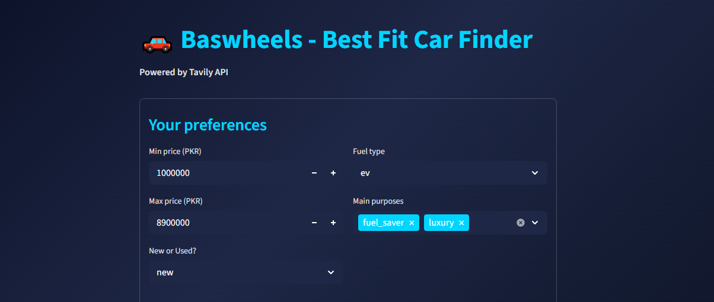|  | 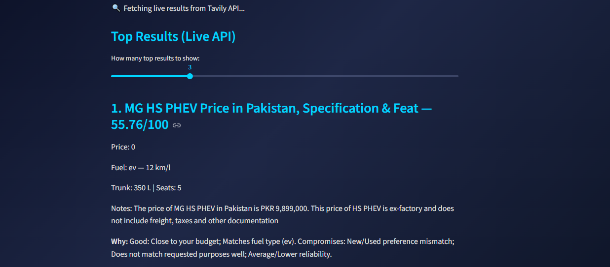|  | 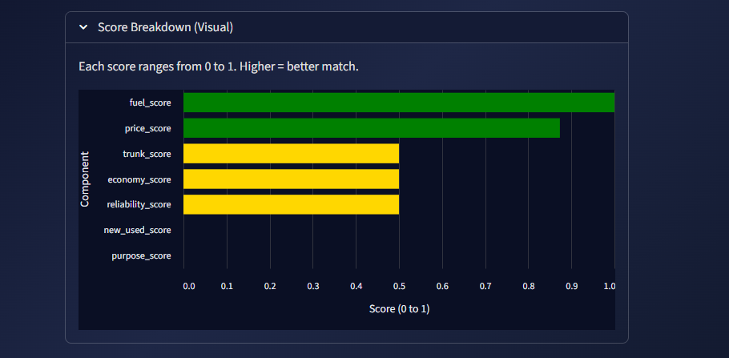|

---

## Future version of project

| Future 01 | Future 02 | Future 03 |
|---:|:---:|:---:|
| 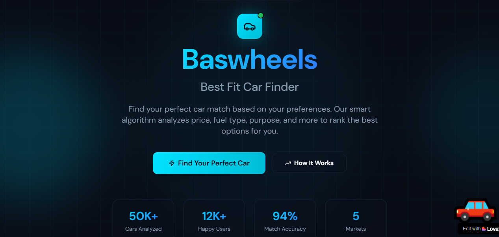 | 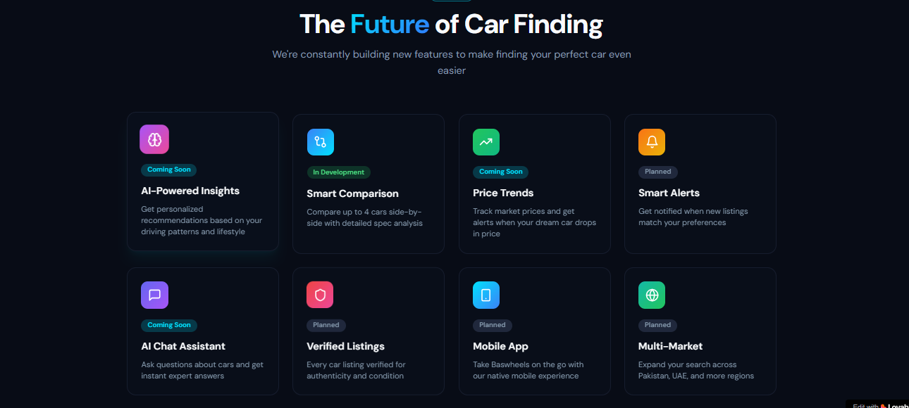 | 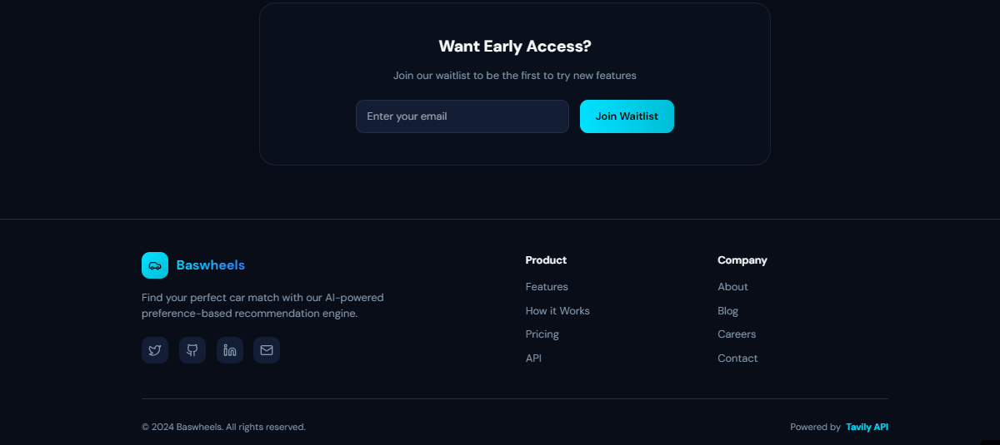 |

| Future 04 | Future 05 | Future 06 |  Future 07 | Future 08
|---:|:---:|:---:|
| 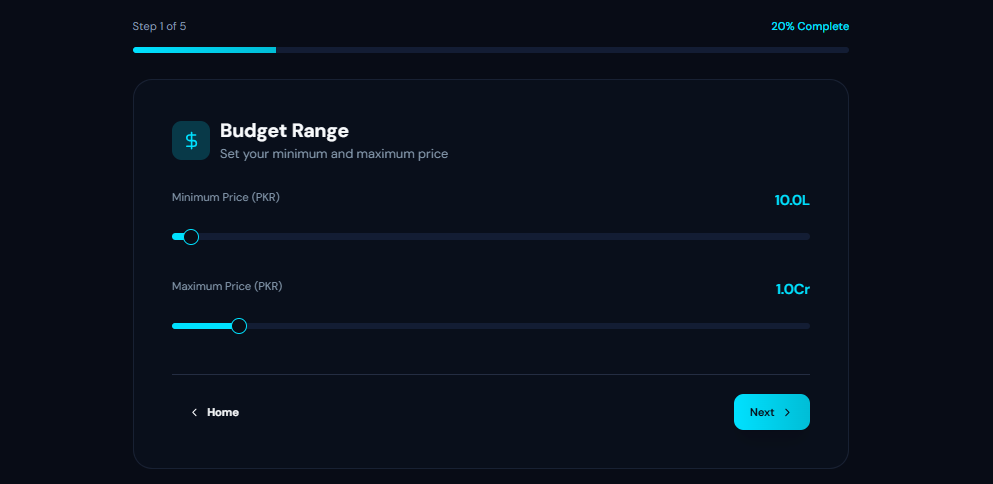 | 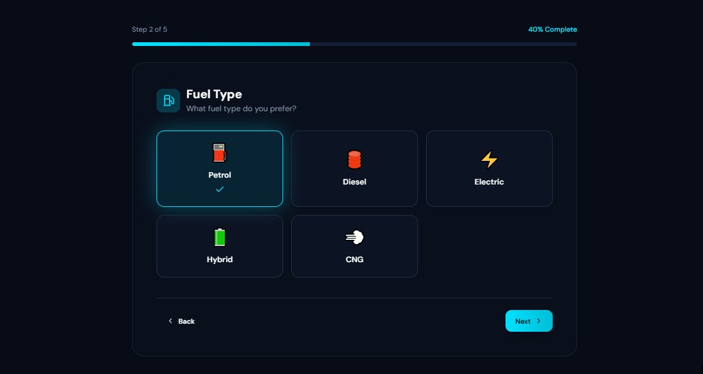 | 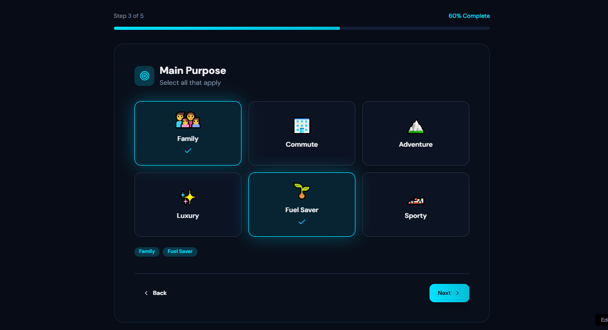 | 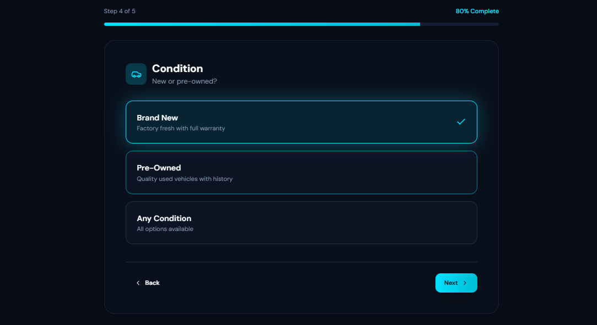 | 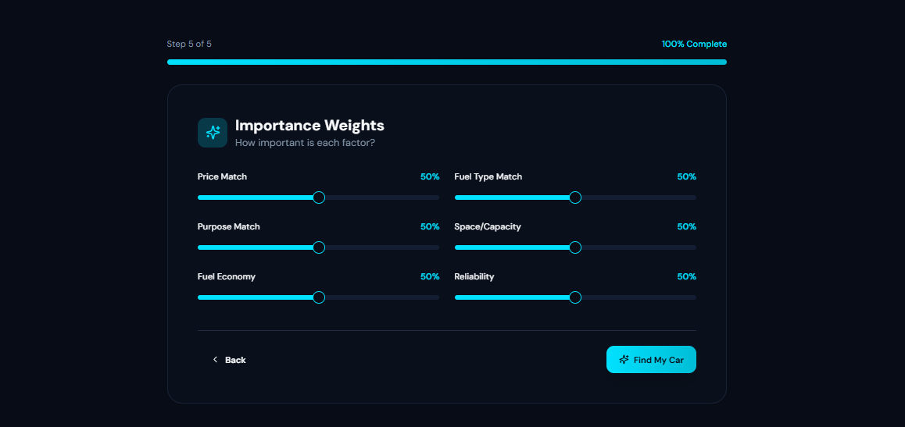 | 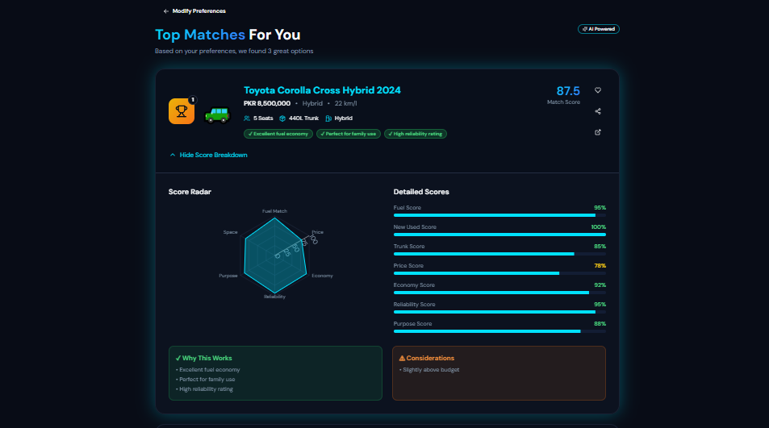

